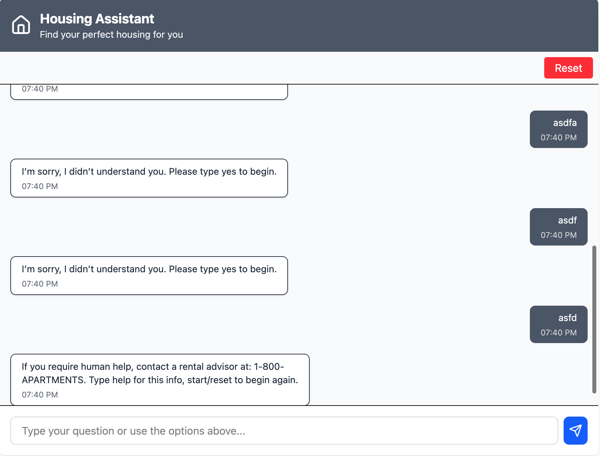
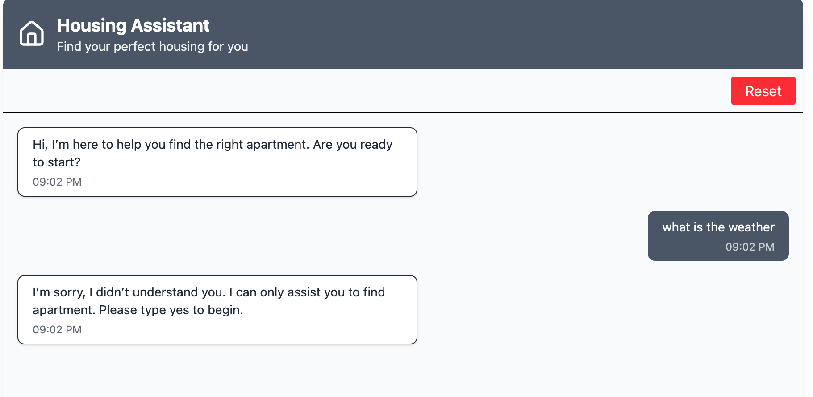
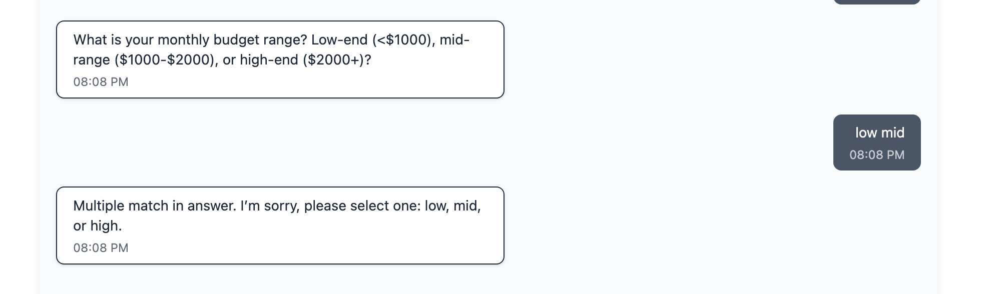
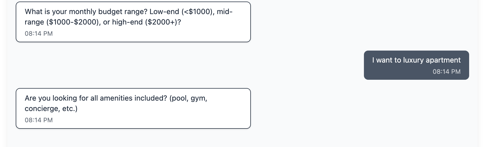
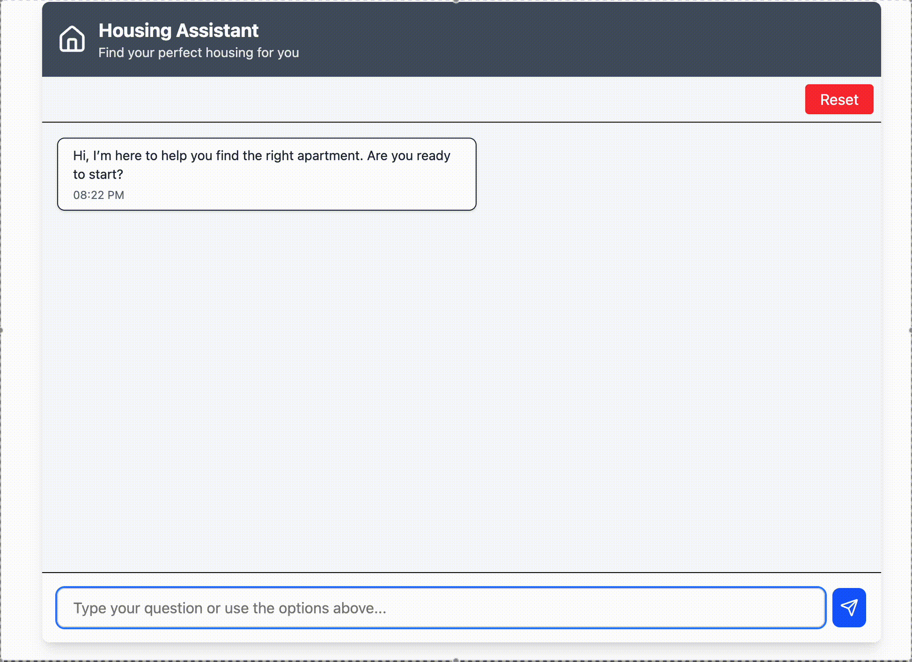
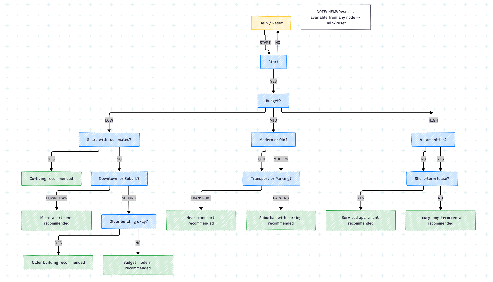

# eGain Project

## About
This chatbot acts as rental advisor, which guides the user through a series of questions to narrow down their preferences based on three main criteria: budget, lifestyle needs, and desired features. This chatbot uses a Finite State Machine and conversation can only be in one of a finite number of "states" at any given time. The bot transitions from one state to another based on the user's input.   Each state has: 
- A message to send to the user.
- A fallback message for when the user's input is not understood.
- on transitions that map user intents to the next state.
- keywords to help interpret the user's raw input into a recognized intent.

After reaching final states, it applies filters on apartments based on the attributes corresponding final to find apartments.

## Tech Stack
This is a static page built with React and JavaScript, with styling handled via Tailwind CSS.

## Setup
You can directly test the application here: https://sameergopali.github.io/chatbot/

Alternatively, follow steps below for local deployment:
1. Download and install node.js and npm for your platform from [here](https://docs.npmjs.com/downloading-and-installing-node-js-and-npm)

2. **Clone the repository**
    ```bash
    git clone https://github.com/sameergopali/egain.git
    ```

3. **Navigate to the project directory**
    ```bash
    cd egain
    ```
4. **Install dependencies**
    ```bash
    npm install
    ```

5. **Start the development server**
    ```bash
    npm run dev
    ```
Server starts at http://localhost:5173/


## Edge Cases Handling
Explain how to use your project. Provide code examples if applicable.
1. If the user remains stuck and is unable to progress for several steps, a help dialog and support contact information will be displayed.

2. If user's message is out of scope, the bot will try to steer back conversation by providing options user can choose to continue conversation.


3. If multiple intent is present in the user message, the bot notifies the user and asks to select one option.


4. Support variations of keyword for answering the questions.


## Example Cases

## Flowchart

